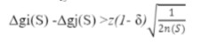
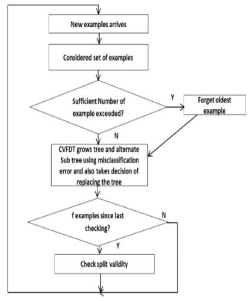
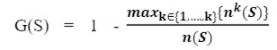
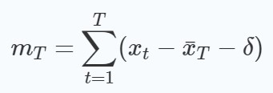

# HW03 - Machine Learning
### _**Mohammad Doosti Lakhani - 98722278**_

This notebook consists of:
1. CVFDT
    1. Definition
    2. Decision Tree for Data Stream
    3. Criteria
    4. References
2. Stability of Stream Learning
    1. Definition
    2. Approaches
    3. References

## 1 CVFDT
1. Definition
2. Decision Tree for Data Stream
3. Criteria
4. References

### 1.A Definition
Data stream can be defined as flow of the data which is generated continuously. ATM, Email, Social media transactions are are samples for this kind of data input. Standard data mining algorithms fail to capture this problem as they are intrinsicly defined to be static as in some cases they need to capture the distribution of all data before building the model.

Here are some challenges in Data Stream Learning:
1. On-demand data analysis because of memory limit problem
2. Speed of analysis to capture all incoming data
3. Handling of drift problem

CVFDT grows an alternative tree for questionable oldest data and replace the old with the new one when new tree becomes more accurate. Therefore new splitting criterion is required as in this paper *misclassification error* has been used. This criterion removes the incorrect use of *hoeffding bound* which is the core of Very Fast Decision Trees.

This approach enables the model to choose best split attribute on available data which also is the best possible derived from a possible whole infinte data stream.

### 1.B Decision Tree for Data Stream

*Hoeffding* trees can be learned in constant time per example, more precisely in time that is worst-case proportional to the number of attributes. *Hoeffding bound* valuates how many examples are enough to decide the node in the decision tree.

In both aforementioned trees, Gini and Information Gain has been used as the attribute selection criteria.

VFDT trees make assumption that training data is random samples drawn from stationary distribution, but data streams available for mining violate this assumption. It is more accurate to assume that the data was generated by multiple concepts with time varying concept.

The drift concept (Relevancy of data over time) can be addressed with high speed and accuracy of CVFDT.

One of the reasons that *Misclassification error* criterion works well is that it has been proven that most of the problem that arises in decision trees while learning stream data is due to non linearity of attribute selection criterions such as Gini and Information Gain.

To handle data stream learning, we need to consider a window of data to further process. Note that the speed of incoming data may arise window overflow which causes loosing last used data in window. But in CVFDT, for each node enough statistical information has been preserved to only drop entries of data that has least contribute to the learning.

Another challenge is when data changes over time, the previously chosen split points are no longer valid as the concept might have been changed. In this case, CVFDT grows an alternative subtree with new best attribute (chosen based on misclassification criterion) at its root. If new subtree has better score, it will be replaced.

The new tree replacement is made with the following condition:

Here is the architecture:

### 1.C Criterion
As we said before, this criterion removes the incorrect use of hoeffding bound which is the core of Very Fast Decision Trees.

Misclassification error has strong matchematical background and can be expressed as follow:

Where *G(s)* is a misclassification error of *S*, *k* is number of classes, *n(S)* is the cardinality of *S*, *nk* is number of elements of set *S* from kth class.

### 1.D References

1. *G. HUlten, L. Spencer, and P. Domingos, "Mining time-changing data streams" in Proc, 7th ACM SIGKDD Int. Conf. Knowl. Discovery and Data Mining. 2001. pp. 97-106.*
2. *A. Jadhav, S.P. Kosbatwar, "Concept-adapting Very Fast Decision Tree with Misclassification Error" in IJARCET, June 2016, V. 5, I. 6*

## 2 Stability of Stream Learning
1. Definition
2. Approaches
3. References

### 2.A Definition

Most streaming decision models evolve continuously over time, run in resource-aware environments, and detect and react to changes in the environment generating data. One important issue, not yet convincingly addressed, is the design of experimental work to evaluate and compare decision models that evolve over time.
  
Non-stationary or concept drift is the main source of instability of possible algrotithms. To address this issue, it is not feasible to try to learn underlying distribution of data over time as the speed of incoming infinite data is another challenge, that's why we incorporate *change detections* that monitors the evalution of learning algorithm.

Another problem on top of Stability is the *reproducibility* of experiment. To enable achieving models than capture this issues, following algorithms has been considered to provide a better evalution of stability and reproducibility for models working in stream data learning.

### 2.B Approaches

Some useful evaluation metrics for assessing change detection methods:
1. Probability of True detection: capacity to detect drift when it occurs
2. Probability of False alarms: resilience to false alarms when there is no drift; that is not detect drift when there is no change in the target concept;
3. Delay in detection: the number of examples required to detect a change after the occurrence of a change.

**The Page-Hinkley algorithm:** The Page-Hinkley (PH) test is a sequential analysis technique typically used for monitoring change detection in signal processing. It allows efficient detection of changes in the normal behavior of a process which is established by a model. The PH test is designed to detect a change in the average of a Gaussian signal.

This test considers a cumulative variable *mT* , defined as the cumulated difference between the observed values and their mean till the current moment:

where *xT* is average and *δ* corresponds to the magnitude of changes that are allowed.

**Monitoring drift with the ratio of prequential error estimates:** Learning in time-evolving streams requires a tradeoff between memory and forgetting.

A common approach to detect changes. consists of using two sliding windows: a short window containing the most recent information and a large window, used as reference, containing a larger set of recent data including the data in the short window. The rationale behind this approach is that the short window is more reactive while the large window is more conservative. When a change occurs, statistics computed in the short window will capture the event faster than using the statistics in the larger window. Similarly, using fading factors, a smooth forgetting mechanism, a smaller fading factor will detect drifts earlier than larger ones.

the fading factors, besides less memory consumption, get advantage over sliding windows, allowing fast concept drift detections.

Based on this assumption, a new online approach has been proposed to detect concept drift. It has been proposed to perform the PH test with the ratio between two error estimates: a long term error estimate using a large window or a fading factor close to one and a short term error estimate using a short window or a fading factor smaller than the first one. If the short term error estimator is significantly greater than the long term error estimator, we signal a drift alarm.

### 2.C References

1. Gama, J., Sebastião, R. & Rodrigues, P.P. On evaluating stream learning algorithms. Mach Learn 90, 317–346 (2013). https://doi.org/10.1007/s10994-012-5320-9 
